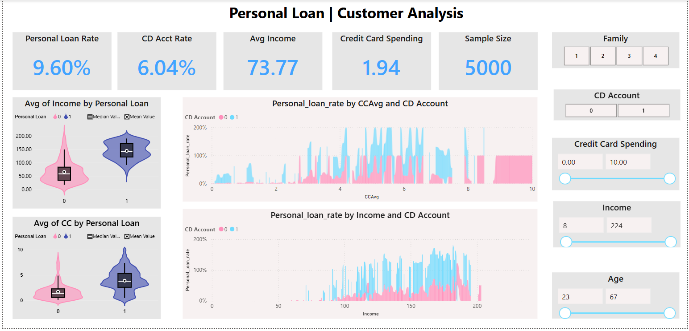

# 💳 Personal Loan Customer Analysis – Power BI Dashboard

This project presents an interactive **Power BI dashboard** built to analyze customer behavior and key factors influencing personal loan acquisition. The dashboard uses a sample dataset of 5,000 customers and focuses on relationships between personal loans, income, credit card spending, CD account ownership, and other demographics.

---

---
## 📊 Dashboard Overview

The dashboard offers a comprehensive view of:

- **Personal Loan Rate:** Overall proportion of customers with personal loans.
- **CD Account Rate:** Percentage of customers holding a Certificate of Deposit account.
- **Average Income:** Mean income of the customer base.
- **Credit Card Spending:** Average monthly spending on credit cards.
- **Sample Size:** Total records analyzed – 5,000 entries.

### Interactive Visuals Include:

- **Violin Plots:** Distribution of income and credit card spending by loan status.
- **Line Charts:** Personal loan rate variations by:
  - CD account ownership and credit card spending
  - CD account ownership and income level
- **Slicers/Filters:** For user-driven filtering by:
  - Family size
  - CD account ownership
  - Credit card spending range
  - Income range
  - Age range

---

## 🔍 Key Insights

- Customers **with CD accounts** tend to have **higher personal loan adoption**.
- **Higher income levels and credit card spenders** are more likely to hold personal loans.
- Clear visual patterns help identify segments for **targeted financial product offerings**.

---

## 🛠 Tools & Technologies

- **Power BI** – For interactive dashboard design and data visualization  
- **DAX** – For creating dynamic measures and logic  
- **Sample Dataset** – Structured tabular data of 5,000 customer records  

---
